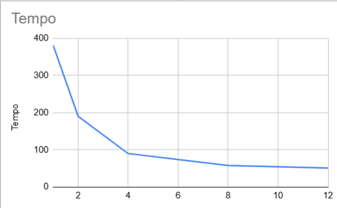
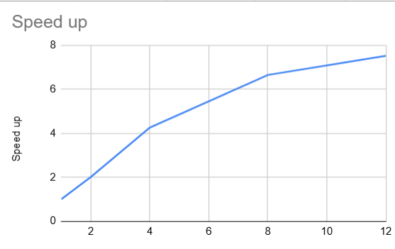
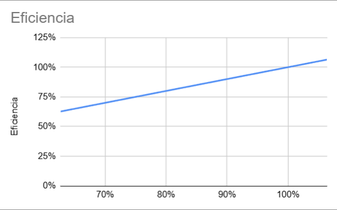

# Processamento Concorrente de Avaliações da Steam em Larga Escala

## Descrição do Projeto

Este projeto tem como objetivo realizar o processamento concorrente de avaliações da plataforma Steam em larga escala, permitindo identificar padrões de satisfação e insatisfação dos jogadores por meio da análise de grandes volumes de dados.

A proposta combina técnicas de:

- Programação concorrente
- Paralelismo
- Processamento de dados
- Análise de sentimentos
- Manipulação de arquivos massivos
- Benchmarking de desempenho

O sistema foi desenvolvido com foco em desempenho, escalabilidade e eficiência computacional, utilizando múltiplos processos para acelerar o processamento das avaliações.

---

# Objetivos

## Objetivo Geral

Desenvolver uma aplicação capaz de processar milhares ou milhões de avaliações da Steam de forma concorrente, reduzindo o tempo de execução e permitindo a extração de informações relevantes sobre a experiência dos jogadores.

## Objetivos Específicos

- Ler arquivos massivos contendo avaliações.
- Processar avaliações simultaneamente.
- Identificar padrões de satisfação e insatisfação.
- Realizar análises estatísticas das avaliações.
- Comparar o desempenho entre execução serial e paralela.
- Calcular Speedup e Eficiência.

---

# Problema Resolvido

O processamento de grandes volumes de avaliações pode se tornar extremamente lento quando executado de forma sequencial.

Com o uso de programação concorrente e paralelismo, o sistema distribui a carga de trabalho entre múltiplos núcleos do processador, reduzindo significativamente o tempo total de processamento.

Essa abordagem permite:

- Processar datasets massivos.
- Melhorar o desempenho computacional.
- Tornar a análise viável em larga escala.
- Simular cenários reais de Big Data.

---

# Tecnologias Utilizadas

## Linguagem

- Python 3

## Bibliotecas

- multiprocessing
- collections.Counter
- pathlib
- argparse
- json
- time
- time.perf_counter
- matplotlib
- numpy

---

# Arquitetura do Projeto

O sistema foi dividido em módulos responsáveis pela leitura dos arquivos, distribuição das tarefas entre os processos, processamento das avaliações e geração das métricas finais.

Fluxo simplificado:

```
Arquivos CSV
      │
      ▼
 Leitura dos dados
      │
      ▼
Divisão em processos (Pool)
      │
      ▼
Processamento paralelo
      │
      ▼
Agregação dos resultados
      │
      ▼
Geração das estatísticas
      │
      ▼
Exportação em JSON + Gráficos
```

---

# Ambiente Experimental

| Item | Descrição |
|------|-----------|
| Processador | AMD Ryzen 7 5700X |
| Núcleos | 8 Cores / 16 Threads |
| Memória RAM | 32 GB DDR4 |
| Sistema Operacional | Windows 11 |
| Linguagem | Python 3 |
| Biblioteca de Paralelização | multiprocessing |
| Ambiente de Desenvolvimento | Visual Studio Code |

---

# Concorrência e Paralelismo

O projeto utiliza programação concorrente baseada em múltiplos processos para explorar todos os núcleos disponíveis do processador.

## Estratégias Utilizadas

### Multiprocessing

Utiliza a biblioteca `multiprocessing`, permitindo que vários processos executem simultaneamente em diferentes núcleos da CPU.

### Pool de Processos

A distribuição das tarefas é realizada por meio de um `Pool`, responsável por dividir automaticamente os arquivos entre os workers disponíveis.

### Balanceamento de Carga

Cada processo recebe uma parte do conjunto de avaliações, reduzindo o tempo total de processamento.

---

# Métricas Avaliadas

Durante a execução são calculadas diversas métricas de desempenho.

## Métricas

- Tempo de execução
- Speedup
- Eficiência
- Escalabilidade
- Ganho de desempenho

## Fórmula do Speedup

```
Speedup = Tempo Serial / Tempo Paralelo
```

## Fórmula da Eficiência

```
Eficiência = Speedup / Número de Processos
```

---

# Resultados

## Gráfico de Tempo de Execução



---

## Gráfico de Speedup



---

## Gráfico de Eficiência



---

# Benchmark

Exemplo de comparação entre diferentes quantidades de processos.

| Processos | Tempo (s) | Speedup | Eficiência |
|-----------|----------:|---------:|-----------:|
| 1 | 381,32 | 1,00 | 100% |
| 2 | 189,85 | 2,01 | 100,43% |
| 4 | 89,63 | 4,25 | 106,36% |
| 8 | 57,37 | 6,65 | 83,08% |
| 12 | 50,71 | 7,52 | 62,66% |

---

# Conceitos Aplicados

Este projeto aborda diversos conceitos fundamentais da computação paralela:

- Programação concorrente
- Paralelismo
- Multiprocessing
- Escalabilidade
- Benchmarking
- Big Data
- Balanceamento de carga
- Processamento de linguagem natural (NLP)
- Processamento massivo de dados
- Medição de desempenho

---

# Aplicações Reais

A solução pode ser aplicada em diversos cenários, como:

- Plataformas de jogos
- Marketplaces
- Redes sociais
- Sistemas de recomendação
- Plataformas de streaming
- Sistemas de feedback
- Análise de opinião pública
- Mineração de dados

---

# Conclusão

Os resultados obtidos demonstram que a utilização de processamento paralelo reduz significativamente o tempo necessário para analisar grandes volumes de avaliações.

À medida que o número de processos aumenta, o sistema aproveita melhor os recursos disponíveis do processador, proporcionando ganhos expressivos de desempenho. Entretanto, devido aos custos de sincronização, comunicação e gerenciamento dos processos, o ganho tende a diminuir após determinado número de workers, comportamento esperado em aplicações paralelas.

O projeto evidencia, na prática, como técnicas de programação concorrente e paralelismo podem ser utilizadas para resolver problemas reais envolvendo processamento massivo de dados e análise de sentimentos em larga escala.

---

## Licença

Este projeto foi desenvolvido para fins acadêmicos e está disponível para estudos e aprendizado.
